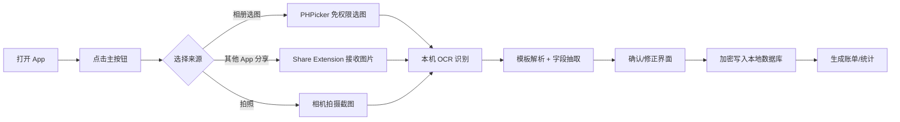

# OpenLedger 智能记账 App —— 开发计划

> 版本：v0.5（规划定稿） · 日期：2026-08-03
> 定位：一款数据默认保存在本机、支持加密导出与 AirDrop 近距同步的跨平台记账应用（iPhone / iPad / Mac / Android），通过"一个主按钮 + 支付截图"完成自动记账。

---

## 1. 产品概述

### 1.1 一句话定位

用户把微信、支付宝、云闪付、抖音等平台的支付成功截图交给 OpenLedger，App 在本机完成识别、解析、加密存储；多端之间可通过隔空投送加密传输账本（可选项，默认纯本地）。

### 1.2 核心原则

| 原则 | 含义 |
| --- | --- |
| 本地优先 | 识别、解析、加密均在本机完成，不联网也能完整使用 |
| 隐私至上 | 敏感字段加密存储；同步仅传输密文，服务端零知识 |
| 一个按钮 | 主界面只突出一个核心操作：导入支付截图 |
| 系统原生 | Apple 三端基于 iOS/iPadOS/macOS 26+ 的 Liquid Glass；Android 保持同一视觉语言 |
| AirDrop 可选 | 默认纯本地；近距传输由用户手动发起，全程加密 |
| 开源透明 | 代码开源、加密方案可审计，隐私承诺可用代码验证 |

### 1.3 目标用户

在意支付隐私、希望零成本自动记账的人群；用户画像为"不想手动记，又不敢把账单交给云服务"。

---

## 2. 核心体验流程

**关键交互要求**：从点击主按钮到完成保存，理想情况不超过 10 秒；识别结果默认可信，用户只需扫一眼即可确认。

---

## 3. 功能范围

### 3.1 MVP（第一版必须）

1. **主按钮导入**
   - 首页中央一个 Liquid Glass 大按钮，点击弹出来源选择（相册 / 拍照 / 来自其他 App）。
   - 相册使用 `PHPickerViewController`，**无需申请相册权限**。
2. **截图识别**
   - Vision `VNRecognizeTextRequest` 本机 OCR，支持简体中文。
   - 自动识别支付平台（微信 / 支付宝 / 云闪付 / 抖音支付）。
3. **字段抽取**
   - 金额（含 ¥ 符号、小数点、千分位容错）
   - 商户名称、交易时间、支付方式、交易单号、商品描述、支付状态
   - 不确定的字段高亮标出，交由用户确认/修正。
4. **本地存储**
   - 全部账单存入本地数据库；敏感字段加密后落盘。
5. **账单浏览**
   - 按时间倒序的账单列表、单笔详情、按月汇总。
6. **重复导入防护**
   - 以交易单号哈希去重，重复截图给出提示而非重复记账。
7. **截图保留策略（设置项）**
   - 默认**只保留缩略图**用于列表展示，不保留原图（隐私面最小）；
   - 设置中可选"保留原图"，原图以加密文件形式存入沙盒（需用户主动开启）。
8. **加密导出 / 恢复（MVP 必做）**
   - 导出：用户设置口令 → 口令派生密钥（HKDF + 随机盐）→ 加密打包账单（JSON/CSV）到"文件"App 或系统分享（含**隔空投送**，可直接传给另一台 Apple 设备）；
   - 恢复：选择加密包 → 输入口令 → 校验解包 → 合并或覆盖导入；
   - 防误操作：导出/恢复前明确提示"口令丢失则备份无法恢复"。

### 3.2 V1.x 迭代（按已确认优先级排序）

1. **平台账单对账**（第一优先）：导入微信/支付宝官方账单 CSV，自动对账、标出漏记的截图。
2. **Face ID 应用锁**（第二优先）：面容/指纹解锁、切后台自动模糊、通知与锁屏脱敏。
3. **账单总结提醒**（用户新点子，成本低，可与第 2 项同期）：设置中提供每日 / 每周 / 每月 / 每季度 / 每年总结提醒，全部走本地通知（实现要点见 4.8）。
4. **AirDrop 近距同步**：两台 Apple 设备间通过隔空投送加密传输账本并合并（AirDrop 的定位与限制见 4.9）。
5. **订阅检测与提醒**：识别周期性小额扣款（连续包月等），到期前本地提醒。
6. **隐私脱敏分享卡**：一键生成隐藏单号/商户号的账单分享图。
7. **桌面小组件**：今日支出/预算进度 + 点击直达主按钮。
8. 自动分类、统计报表、手动记账兜底、标签/备注/搜索（基础增强，穿插实现）。

### 3.3 明确不做（当前阶段）

- 不做远程网络同步（当前搁置：多数用户单台设备即可；未来有需求再评估）。
- 不做传统账号体系：不以手机号/邮箱+密码登录，恢复与传输靠口令。
- 不做广告 SDK。
- 不引入云端大模型解析截图（违背本地原则；若未来本地模型能力足够再评估）。
- 不接入远程推送 / APNs：所有提醒一律使用本地通知。

---

## 4. 技术方案

### 4.1 技术栈

| 项 | 选型 | 理由 |
| --- | --- | --- |
| 语言 | Swift 6（严格并发） | 系统生态、性能与安全 |
| UI | SwiftUI | iOS 26 设计语言的官方首选 |
| 最低系统 | iOS 26.0 | 使用 Liquid Glass 原生能力 |
| 工具链 | Xcode 26+ | 支持 iOS 26 SDK |
| 数据模型 | SwiftData（`@Model`） | 类型安全、迁移简单 |
| OCR | Vision `VNRecognizeTextRequest` | 系统级、离线、中文支持好 |
| 加密 | CryptoKit + Keychain | 官方安全组件 |
| 多端 UI | iPad/macOS 复用 SwiftUI 多平台；Android 用 Kotlin + Jetpack Compose | Apple 三端一套代码；Android 独立实现但共享协议 |
| 跨端共享 | 模板规则 JSON 化先行；Kotlin Multiplatform 待 Android 启动时评估 | 现阶段不引入跨端框架，保持单人维护简单 |
| Android OCR | ML Kit 文本识别（离线） | 端侧能力与 Vision 对齐 |
| 近距传输 | 系统分享面板（UIActivityViewController，含隔空投送） | 复用导出/恢复，无需任何服务器 |

### 4.2 截图导入（主按钮背后的能力）

- **PHPicker**：系统级图片选择器，App 拿不到用户整个相册，只拿到选中的图片，天然最小权限。
- **Share Extension**：用户在微信/支付宝详情页截图后，可从照片 App 直接"共享到记账 App"。
- **相机**：直接拍摄另一台设备上的支付页面（低频场景，作为兜底）。

### 4.3 识别与解析管线

1. **图像预处理**：校正方向、提高对比度（`CIFilter`），提升低光截图识别率。
2. **OCR**：`VNRecognizeTextRequest`
   - `recognitionLevel = .accurate`，`usesLanguageCorrection = true`
   - 识别语言 `["zh-Hans", "en-US"]`，覆盖中文+数字混合场景。
3. **平台识别**：文本特征匹配（"微信支付""支付宝""云闪付""抖音支付"等标志性词），也可用轻量 Core ML 图像分类模型判断平台。
4. **字段解析（规则引擎）**：
   - 为每个平台维护一份**模板规则**（关键词锚点 + 正则），例如微信的"微信支付凭证"、金额行的"¥xxx"、单号格式。
   - 输出标准化字段模型 `PaymentDraft`（金额、商户、时间、单号…），字段带置信度。
   - 金额做二次校验：小数点位数、千分位、与"实付/合计"锚点的一致性。
5. **人工确认**：低置信度字段高亮，用户可直接编辑；确认后入库。

> 设计要点：规则引擎做成**可配置模板**（JSON 配置驱动），某个平台改版后只更新模板，不改 App 逻辑。

### 4.4 数据模型（草案）

`PaymentRecord`（SwiftData @Model）：

| 字段 | 类型 | 是否加密 | 说明 |
| --- | --- | --- | --- |
| id | UUID | — | 主键 |
| amount | Decimal | 否* | 金额，需参与统计查询 |
| currency | String | 否 | 币种，默认 CNY |
| merchantName | String | 否* | 商户名，用于列表展示 |
| category | String | 否 | 分类，本地规则生成 |
| paidAt | Date | 否 | 交易时间，参与排序统计 |
| platform | String | 否 | 微信/支付宝/云闪付/抖音 |
| transactionId | String | **是** | 交易单号，敏感 |
| transactionIdHash | String | 否 | 单号 SHA-256，用于去重 |
| description | String | **是** | 商品/订单描述 |
| rawOcrText | String | **是** | OCR 原文，供审计与纠错 |
| notes | String | **是** | 用户备注 |
| screenshotRef | String | 视配置 | 原图引用，默认不保留；开启后加密存储 |
| createdAt / updatedAt | Date | 否 | 审计时间 |

\* 金额与商户名属于"可查询字段"：为支持统计、搜索而明文存储；交易单号、描述、OCR 原文等敏感内容整体加密。若追求更高安全等级，可改为全库加密（见 4.6 方案 B），代价是查询/统计变复杂。

### 4.5 本地存储选型

**方案 A（推荐）：SwiftData + 应用层加密**

- 账单结构化字段存 SwiftData，敏感字段以 CryptoKit 加密后的 `Data` 存储。
- 优点：开发效率高、迁移友好、与 SwiftUI 天然集成。
- 缺点：数据库文件本身未整体加密，需要依赖文件保护级别兜底。

**方案 B（备选）：SQLite + SQLCipher**

- 整个数据库文件 AES-256 加密，密钥存 Keychain。
- 优点：落盘即密文，安全性上限更高。
- 缺点：无 SwiftData 便利性，查询/迁移需要自己写，开发成本约多 20–30%。

> 建议 MVP 用方案 A，若安全审计后不达标再升级方案 B；两种方案的数据模型可复用。

### 4.6 加密与安全设计

1. **密钥管理（Keychain）**
   - 首次启动生成随机 256 位主密钥，存入 Keychain。
   - 访问级别：`kSecAttrAccessibleWhenUnlockedThisDeviceOnly`（设备锁定时不可读，且不随备份迁移到其他设备）。
2. **字段加密（CryptoKit）**
   - 敏感字段用 AES-256-GCM 加密，随机 nonce，密文+tag 一同落库。
   - 单号哈希用 SHA-256 明文存储，仅用于去重，不可逆推出原单号。
3. **文件保护**
   - 截图/缓存目录设置 `NSFileProtectionComplete`，App 在后台时数据不可读。
   - 关键文件加 `NSURLIsExcludedFromBackupKey`，默认不进 iCloud 备份。
4. **导出/恢复（MVP 起提供）**
   - 导出时用用户口令派生密钥（HKDF + 随机盐）加密备份包；恢复时输入口令解密。
   - 主密钥只在本机 Keychain，口令忘记则备份不可恢复（需要提前明确告知用户）。
5. **网络策略**
   - 默认不申请任何网络权限；App 发布时声明"不使用网络"。
6. **隐私合规**
   - 添加 `PrivacyInfo.xcprivacy` 隐私清单；App Store 隐私标签如实申报"不收集数据"。
7. **应用锁与防偷窥（V1.x）**
   - 可选 Face ID / Touch ID 解锁；切后台自动模糊 App 切换器预览。
   - 通知与锁屏默认隐藏金额，只显示"今日新增 N 笔支出"，可在设置中开启显示金额。

### 4.7 iOS 26 Liquid Glass 设计

遵循 iOS 26 全新设计语言，核心元素：

- **主按钮**：首页中央大尺寸 Liquid Glass 圆形按钮，使用 `.glassEffect()`，带动态光泽与按压反馈；是产品的视觉锚点。
- **材质分层**：`GlassEffectContainer` 组织多个玻璃元素，让列表、工具栏、浮层随背景内容产生真实的折射与模糊。
- **导航结构**：采用 Liquid Glass 标签栏（底部 Tab：账单 / 统计 / 设置），半透明悬浮样式。
- **浮层与弹窗**：确认记账使用玻璃质感 sheet，边缘贴合屏幕曲率（iOS 26 sheet 默认 inset + Liquid Glass 背景）。
- **系统一致性**：支持深色/浅色模式、Dynamic Type 无障碍字号、灵动岛与实时活动（可选：导入进度）。
- **动效**：导入成功时按钮上的数字"流入"账单列表，用 `matchedGeometryEffect` 做无缝衔接动画。

> 落地约束：所有玻璃材质必须有真实内容在背后才有效果，避免在纯色背景上滥用；Apple 官方建议"玻璃之下要有内容"。

> 多端设计：Liquid Glass 同一套设计语言覆盖 iPhone / iPad / macOS；Android 端保持一致的布局与色彩语义，但不强行模仿玻璃材质。

---

### 4.8 本地提醒（账单总结）实现要点

- 技术：`UserNotifications` 本地通知，无需网络与远程推送。
- 频率与时间：每日 / 每周 / 每月 / 每季度 / 每年；默认每日 21:00（已确认）、每周一 21:00、每月 1 日 21:00，用户可自定义时间和星期。
- 内容示例："今日支出 ¥86.50，共 5 笔""本月支出 ¥2,318.00，餐饮占比 42%"；季度/年度同构。
- 数据新鲜度策略：新增账单或打开 App 时，重排下一次通知并刷新汇总内容；若用户多日未打开，到点展示的是最近一次计算的汇总（在提醒设置页明确说明这一点）。
- 权限最小化：进入提醒设置页时才请求通知权限；支持总开关与逐项开关（每日/每周/每月/每季度/每年）。
- 隐私联动：锁屏通知默认不显示金额，与 Face ID 应用锁策略一致。
- 扩展：汇总内容同步渲染到小组件，作为通知之外的常驻查看入口（V1.x）。

---

### 4.9 多端同步（AirDrop 近距传输）

- **定位**：AirDrop 是"近距离、主动、一次性"的加密文件传输，**不是后台同步服务**。经确认，远程网络同步暂时搁置（多数用户以单台设备为主，未来有需求再评估），当前只做 AirDrop 近距同步。
- **适用场景**：
  - 换机 / 新设备加入：一键把加密账本 AirDrop 到新设备，输入口令解密并合并；
  - 临时对账：给家人或另一台自己的设备传一份可合并副本。
- **实现方式**：复用 MVP 的加密导出/恢复——导出文件用口令派生密钥（HKDF + 随机盐）加密，接收端输入口令解密后按"版本号 + 时间戳"合并；删除用墓碑（tombstone），异常冲突提示用户手动处理。不引入同步组密钥、设备吊销、后台任务等网络同步设施，保持实现简单。
- **限制与说明**：需要两台设备面对面、用户手动发起；Android 不支持 AirDrop（未来做 Android 时，可支持通过其他通道传输同一格式的加密文件）。

---

### 4.10 开源与发布策略（已确认按开源规划）

- **仓库与许可证**：代码托管 GitHub；客户端采用 **MIT 许可证（已确认）**；当前无服务端组件，不涉及中继许可证。
- **安全披露**：提供 `SECURITY.md` 与漏洞上报渠道；加密设计文档随仓库发布，接受社区审计。
- **持续集成**：GitHub Actions 跑单元测试、UI 测试、跨端加密测试向量校验；TestFlight 与未来 Play 商店发布流程文档化。
- **隐私承诺页**：App 内"隐私与开源"页面，链接仓库与加密设计说明，把"零知识"做成可验证的承诺。
- **成本控制**：不引入任何需要付费的构建服务；单人维护以"小步提交 + 自动化测试"为主。

---

## 5. 里程碑与排期

假设 1 名熟练 iOS 开发者 + 每周约 40 小时：

| 里程碑 | 内容 | 周期 | 验收标准 |
| --- | --- | --- | --- |
| M0 概念验证 | OCR 识别微信/支付宝各 20 张真实截图，字段解析准确率 ≥ 90% | 1 周 | 演示 App 能从截图提出"金额/商户/时间/单号" |
| M1 iOS MVP（iPhone） | 主按钮 + 选图 + 识别 + 确认页 + 本地存储 + 账单列表；加密导出/恢复 + 截图保留策略设置 | 4–5 周 | 完整闭环可用；导出文件可异地恢复，口令错误无法解密 |
| M2 多平台 + 增值功能 V1 | 云闪付/抖音模板、自动分类、月度统计、去重；平台账单对账、Face ID 应用锁、账单总结提醒 | 3–4 周 | 四平台识别率 ≥ 90%；对账能标出漏记；提醒按设置准时送达且锁屏脱敏 |
| M3 安全加固 | 字段加密、Keychain、文件保护、隐私清单、越狱检测（可选） | 2 周 | 安全测试：锁屏后数据不可读、无网络流量 |
| M4 Apple 三端 + 上架 | iPad/macOS 适配、Liquid Glass 打磨、动效、空态/错误态、TestFlight 内测、App Store 提审 | 3 周 | iPhone/iPad/Mac 三端通过审核并发布 |
| M5 AirDrop 近距同步 | 加密文件传输、口令解密、合并导入（版本 + 墓碑、冲突提示） | 2–3 周 | AirDrop 传输合并不丢账、不重复；冲突可手动处理 |
| M6 Android 客户端（iOS 上线后启动） | Kotlin/Compose、ML Kit、Room、加密文件互导、Play 商店上架 | 6–8 周 | Android 与 iOS 识别、数据互通，加密文件可互导 |
| M7 跨端打磨 | 合并回归测试、用户文档、Apple 三端一致性验证 | 2–3 周 | Apple 三端合并稳定，冲突可恢复 |

**排期结论**：

- **按 1 名开发者规划**：iOS 单端（M0–M4）约 **13–15 周**，完成后先上架；
- iOS 上线后再做 AirDrop 近距同步（M5），约 **2–3 周**；
- Android（M6）在 iOS 上线后另行排期，约 **6–8 周**；
- 单人全平台串行总计约 **23–29 周（6–7 个月）**，Android 部分可随时后置。

> 建议：MVP 阶段按多平台架构搭工程（SwiftUI 多平台 + 模板 JSON 化）；AirDrop 直接复用导出/恢复能力，无需预留任何同步服务。

---

## 6. 风险与应对

| 风险 | 影响 | 应对 |
| --- | --- | --- |
| 各平台截图模板频繁改版 | 识别率下降 | 模板 JSON 化，热更新规则（随 App 版本发布）；定期用真实截图回归测试 |
| OCR 金额误读（如 6.66 ↔ 8.66） | 账目错误 | 金额锚点校验 + 置信度提示 + 人工确认页兜底 |
| 复杂截图（多行文本、弹窗遮挡） | 字段缺失 | 保留 OCR 原文可回看；支持手动补录 |
| 主密钥丢失 | 数据永久不可解密 | 提供加密导出/恢复；首次启动即提示"口令即钥匙" |
| 加密与搜索/统计冲突 | 功能受限 | 字段分级（明文可查询字段 vs 加密敏感字段），定期评估 SQLCipher |
| 纯本地解析能力有限 | 无法识别生僻模板 | 规则引擎 + 可插拔本地模型；评估 Apple 新 Vision API 与 Core ML 蒸馏 |
| iOS 26 API 兼容问题 | 开发受阻 | 真机测试矩阵（iPhone 15/16/17 系），关注 beta 发布节奏 |
| AirDrop 合并数据冲突 | 账目错乱 / 重复 | 版本号 + 时间戳 LWW、墓碑删除、冲突提示与手动解决 |
| AirDrop 被误认为"远程同步" | 用户期望不符 | 设置页明确说明"隔空投送 = 近距手动传输"；远程同步当前不提供 |

---

## 7. 增值功能点子（头脑风暴）

按"与核心价值的关联度 × 实现成本"分三档，供你挑选：

### A. 强烈推荐（与隐私记账强相关，建议纳入 V1.x）

| 点子 | 说明 | 为什么好 |
| --- | --- | --- |
| 平台账单对账 | 导入微信/支付宝官方导出的账单 CSV，自动对账并标出漏记的截图 | 截图记账天然会漏，对账是唯一"查漏"手段，也是信任背书（**已确认 · 第一优先**） |
| Face ID 应用锁 | 打开 App 需面容/指纹；切后台自动模糊预览；通知不显示金额 | 财务类 App 的隐私标配，与"防止偷窥"定位一致（**已确认 · 第二优先**） |
| 隐私脱敏分享卡 | 一键生成隐藏单号/商户号的账单分享图 | 用户对账、发朋友圈时不怕泄露敏感信息 |
| 订阅检测与提醒 | 识别周期性小额扣款（连续包月等），本地通知提前提醒 | 直击"自动续费刺客"痛点，粘性高 |
| 小组件 + 快捷入口 | 桌面组件显示今日支出/预算进度，点击直达主按钮 | 强化"一个按钮"心智，提高打开频率 |

> 已确认：截图默认仅保留缩略图；增值功能先做对账、再 Face ID 锁；另新增「账单总结提醒」（每日/每周/每月/每季度/每年），详见 3.2 与 4.8。

### B. 值得考虑（V1.5+）

| 点子 | 说明 |
| --- | --- |
| App Intents + Siri/Apple Intelligence | 语音或文字"记一笔 25 元早餐 / 上周咖啡花了多少"，全程本地处理 |
| 智能规则与商户别名 | 用户修正自动学习；"星巴克"自动归类咖啡；规则可视化编辑 |
| 本地年度报告 | 生成年度消费报告（本地渲染，可导出脱敏版） |
| 多账本 | 个人/家庭/旅行分账本，通过加密文件在家人间传递（不做云同步） |
| 防篡改账本链 | 每条记录携带前一条哈希，可校验账单未被篡改 |
| 退款跟踪 | 标记退款/售后状态，退款到账本地提醒 |

### C. 暂缓（先不做）

- 远程网络同步（已搁置；未来有需求再评估）
- 银行卡余额与资产账户（需手动维护余额快照，偏离截图记账主场景）
- 电子发票 / 小票识别（可作第二产品线）
- 多币种自动汇率（离线无法可靠更新汇率）

---

## 8. 已确认决策（全部敲定）

- 应用名 **OpenLedger**；按开源项目规划，客户端采用 **MIT 许可证**。
- 截图默认仅保留缩略图（设置中可开启原图加密存储）。
- 加密导出 / 恢复纳入 MVP；多端同步只做 AirDrop 近距传输，远程网络同步搁置。
- 增值功能先做平台账单对账，再做 Face ID 应用锁。
- 账单总结提醒：每日 / 每周 / 每月 / 每季度 / 每年，默认每日 21:00。
- Android 等 iOS 上线后再启动；按 1 名开发者规划排期。

---

## 9. 下一步建议

1. 初始化开源仓库：MIT `LICENSE`、`README`、`SECURITY.md`、GitHub Actions 骨架。
2. 启动 M0：用你手机里真实的微信/支付宝/云闪付/抖音支付截图各 10–20 张做 OCR 与模板验证——这是整个项目最核心的技术风险点。
3. 搭建 Xcode 26 工程骨架，先做出"选图 → 识别 → 展示字段"的最小演示，验证 Liquid Glass 主按钮手感。
